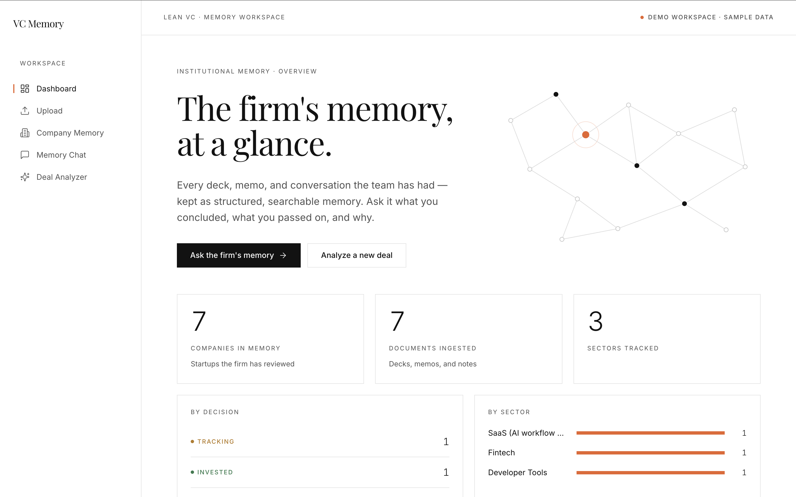
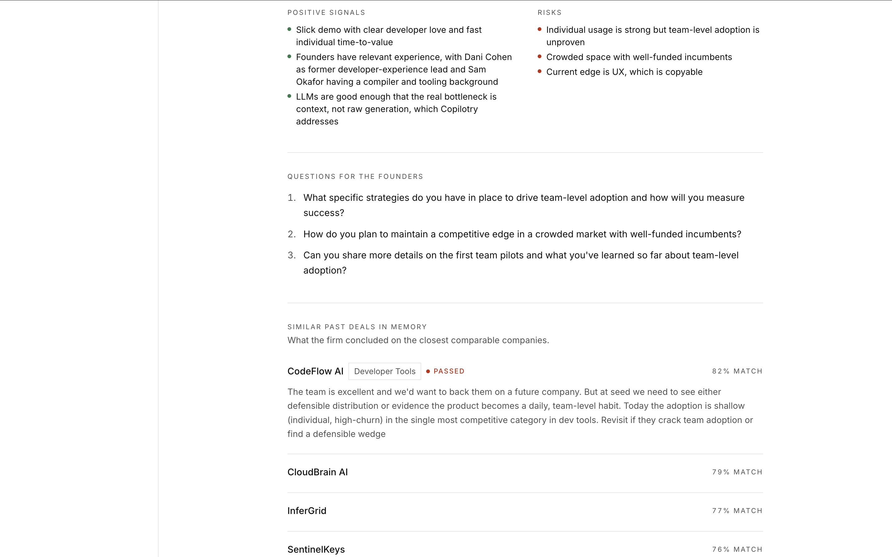

# VC Memory AI

**An AI second brain for lean venture capital teams.**

> **Live demo:** **https://vc-memory-ai.vercel.app** — pre-loaded with demo data,
> no files or setup needed. Try the sample decks in the Deal Analyzer, or ask the
> Memory Chat about a past deal.



A lean VC firm evaluates hundreds of startups a year and generates a huge amount
of valuable knowledge — pitch decks, meeting notes, memos, rejection reasons. But
it scatters across PDFs, docs, email, and personal notes, and the firm slowly
loses its **institutional memory**.

When a founder comes back a year later — _"we've grown 10x"_ — the team needs to
instantly recall: did we meet them? What did we think? Why did we pass? What were
our concerns? Has anything changed?

VC Memory AI turns every document into permanent, searchable memory, then lets
the team **chat with it**, **compare new deals against past ones**, and
**generate partner-ready briefs**. The goal isn't to replace investor judgment —
it's to remove repetitive information-retrieval work so investors spend more time
making judgments.

---

## What it does

1. **Document upload + ingestion** — drop in pitch decks (PDF), memos, and notes.
   AI extracts structured investment intelligence (sector, stage, founders,
   traction, strengths, risks, concerns, and the decision + reason).
2. **VC Memory chatbot** — _"Show me all AI startups we passed on for GTM
   concerns"_ or _"Prep me for tomorrow's FlowAI meeting."_ Answers are grounded
   in the firm's real history, with citations.
3. **New deal analysis + memory comparison** — upload a new deck; get an analysis
   **and** the most similar past deals (what we concluded then, why it matters
   now).
4. **Investment brief generation** — a clean, partner-ready memo with hedged
   recommendation language (the AI never makes the final call).

> **The differentiator:** a new deck isn't just summarized — it's matched against
> the firm's past decisions. Below, a new AI coding tool surfaces _CodeFlow AI_,
> which the firm **passed** on, with the original reasoning attached — so the team
> instantly knows what to dig into.
>
> 

---

## Tech stack

- **Next.js 14 (App Router) + TypeScript** — unified full-stack app (UI + API).
- **Tailwind CSS + a custom design system** — an editorial "confident restraint"
  UI (rtp.vc / Linear / Stripe-inspired): hairlines, square corners, one warm
  accent, generous whitespace.
- **Prisma + PostgreSQL (Neon)** — serverless Postgres on a free, no-card tier,
  so the seeded memory persists on a hosted deploy.
- **Groq (`groq-sdk`)** — `llama-3.3-70b-versatile` powers all AI (extraction,
  chat, analysis, briefs), chosen for strong reasoning on a free tier with no
  credit card. The model sits behind a thin client, so switching to Claude/GPT is
  a one-line change.
- **Voyage AI (`voyage-3.5`)** — vector embeddings for semantic search/RAG.
- **Local vector store** — cosine similarity over Prisma-stored embeddings,
  behind a `VectorStore` interface (swap for Chroma/Pinecone/pgvector later).

See [ARCHITECTURE.md](./ARCHITECTURE.md) for the full design and RAG pipeline.

---

## Quick start

```bash
# 1. Install
npm install

# 2. Configure environment (see .env.example)
cp .env.example .env        # add Neon DATABASE_URL + DIRECT_URL, GROQ_API_KEY, VOYAGE_API_KEY

# 3. Create the tables and ingest the demo corpus (runs the real pipeline)
npm run setup               # = prisma db push && ingest:demo

# 4. Run
npm run dev                 # http://localhost:3000
```

Useful scripts: `npm run db:studio` (browse the DB), `npm run db:push` (apply
schema), `npm run ingest:demo` (reset + re-ingest the demo corpus).

A free Neon database (no credit card) takes ~2 minutes to set up — see
[DEPLOY.md](./DEPLOY.md) for the exact connection-string steps.

> **Demo tip:** the free Voyage embeddings tier is ~3 requests/minute, and each
> chat / analyze / brief makes one embedding call. Run `npm run ingest:demo`
> beforehand and pace live actions a few seconds apart so you never wait on a
> rate-limit backoff mid-demo. (Adding a Voyage card stays free and lifts the
> limit, if you prefer headroom.)

---

## Status

All four features above are **implemented and verified working end-to-end** (on
the live demo and locally) — this is a complete prototype, not a scaffold.

- [ARCHITECTURE.md](./ARCHITECTURE.md) — system design and the RAG pipeline.
- [NOTES.md](./NOTES.md) — case-study write-up: tool/model choices, what didn't
  work, and what I'd extend with more time.

---

## Deployment

Hosted on **Vercel** (app) + **Neon** (Postgres) — both free, no credit card.
Because chunk embeddings are stored during seeding, the live app computes only a
single query embedding per action, staying well under the Voyage free-tier limit.
Full step-by-step (Neon setup → seed → Vercel env vars) is in
[DEPLOY.md](./DEPLOY.md).
